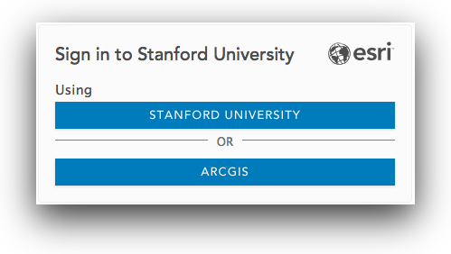

# Creating a field data collection app with your Stanford ArcGIS Online account and Collector for ArcGIS.

## Overview  

This tutorial will introduce the basics of creating a field data collection application using your Stanford ArcGIS Online account and the Collector for ArcGIS apps for iOS and Android.

Topics include:  

1. Capturing places, paths and areas
2. Capturing photos and other attachments
3. Capturing GPS data with mobile devices
4. Taking your app offline
5. Sharing with others

## Tutorial
### Login to your ArcGIS Online Account  
1. Go to [https://stanford.maps.arcgis.com/home/signin.html](https://stanford.maps.arcgis.com/home/signin.html) and **Login** using your **SUNetID & Password** using the Stanford University option.  

  

  ### Create a Feature Layer  

2. Go to **Content**, and in **My Content** click **Create** and choose **Feature Layer** to open the **Create a feature** layer dialog.  
  
3. Select the **Build a layer** category, select **Points, lines, and polygons**, and click **Create**.  
  
4. **Rename** the individual **point, line and polygon layers**.

### Customize Feature Layer Settings
### Add Custom Fields
### Add to a Map Viewer
### Customizing Symbology

