# Creating a field data collection app with your Stanford ArcGIS Online account and Collector for ArcGIS.

## Overview  

This tutorial will introduce the basics of creating a field data collection application using your Stanford ArcGIS Online account and the Collector for ArcGIS apps for iOS and Android. 

Participants will:  
 
* create a basic data collection application
* learn to use domains, or "value lists" to control data quality
* learn to add custom fields
* enable attachments, including photos
* customize user interface to streamline data collection

## Part 1: Create a Feature Layer  

### Login to arcgis.com  

1. Go to [https://stanford.maps.arcgis.com/home/signin.html](https://stanford.maps.arcgis.com/home/signin.html) and **Login** using your **SUNetID & Password** using the Stanford University option.  

  
  
### Create an empty feature layer
  
2. Go to **Content**, and in **My Content** click **Create** and choose **Feature Layer** to open the **Create a feature layer** dialog.  

3. Select the **Build a layer** category, select **Points, lines, and polygons**, and click **Create**.  

4. **Rename** the individual **point, line and polygon layers**  
  
  shape|name
  ----:|:----
  point|Place
  line|Path
  polygon|Area of Interest  
  

5. Set the **extent** for your layer and click **Next**.  

6. Provide a **title**, like "**Walking Tour**".  *Since this must be a unique name in your organization, you might need to include your initials if others have followed these same steps*. Click **Done**.  

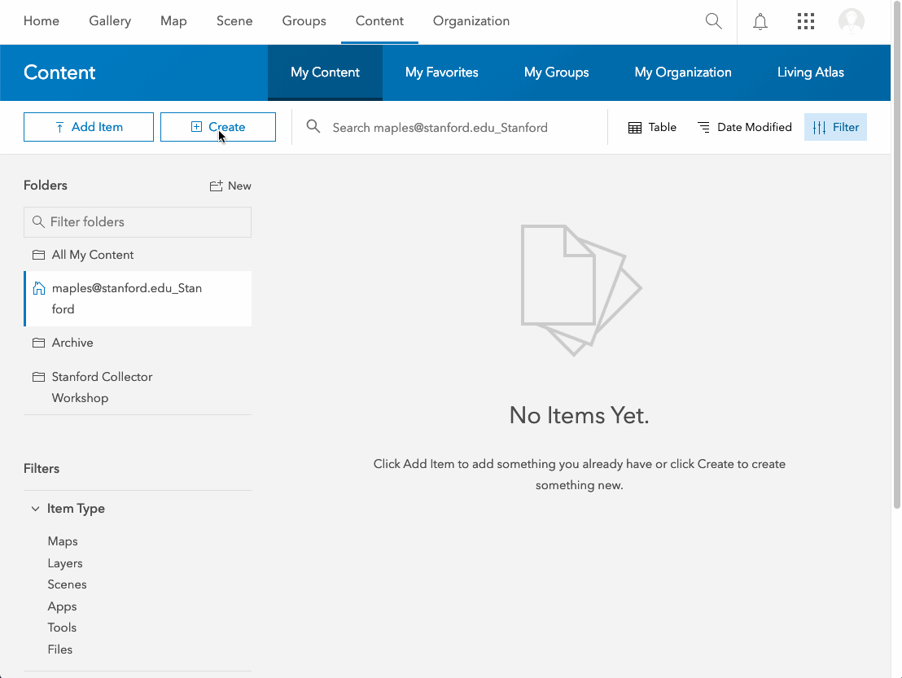  
  

  Your **Walking Tour layer** is created and its item details page should open. In the following steps you’ll create the fields that define the form for the Places layer.  
  
  
    
### Add fields to the feature class

7. Go to the **Data tab** of the item page and go to **Fields**. If you created layers for points, lines, and polygons, verify that ***Place*** is chosen in the list of layers.  

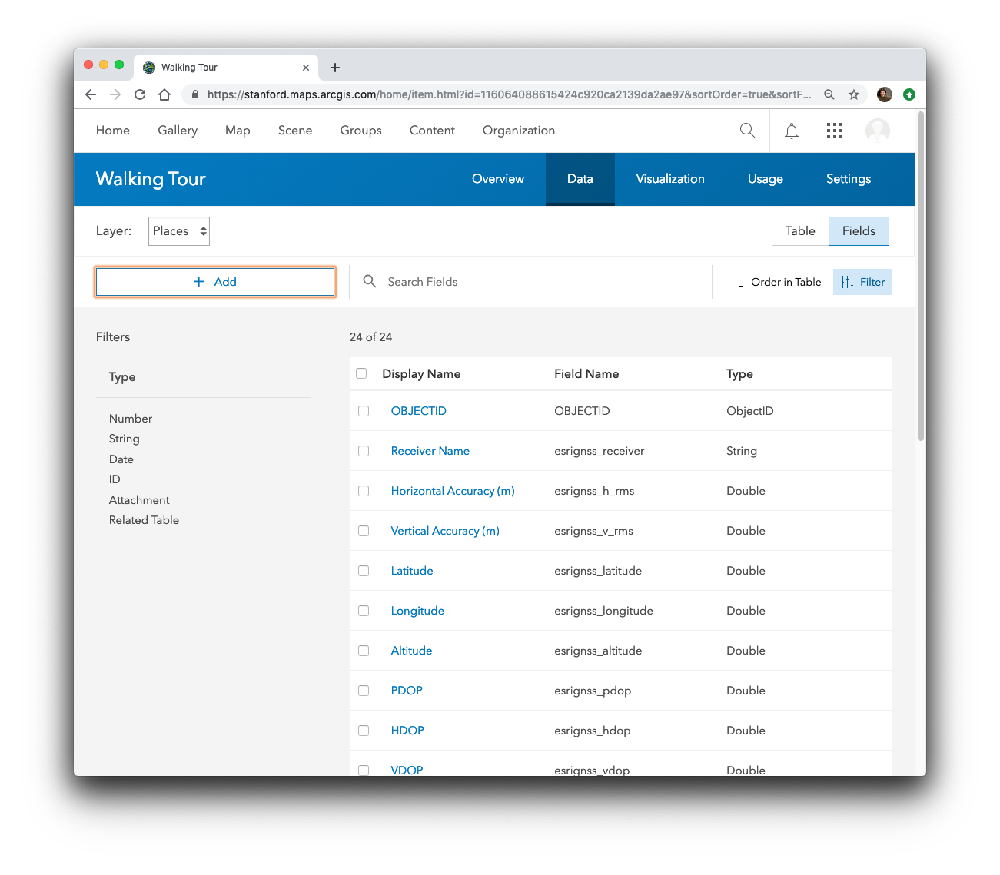  
  
8. Click **Add**. Give a name ***PlaceType*** and an alias ***Point of Interest Type***. Choose type: **String**. Accept the other defaults and click **Add New Field**.  

   
  
### Create a Domain (values list) for the places layer
  
9. Click ***Point of Interest*** in the Display Name list and click **Create List** to create a list of choices for the **POI Types**.
Type a label of **Art** with a code of **0**.  

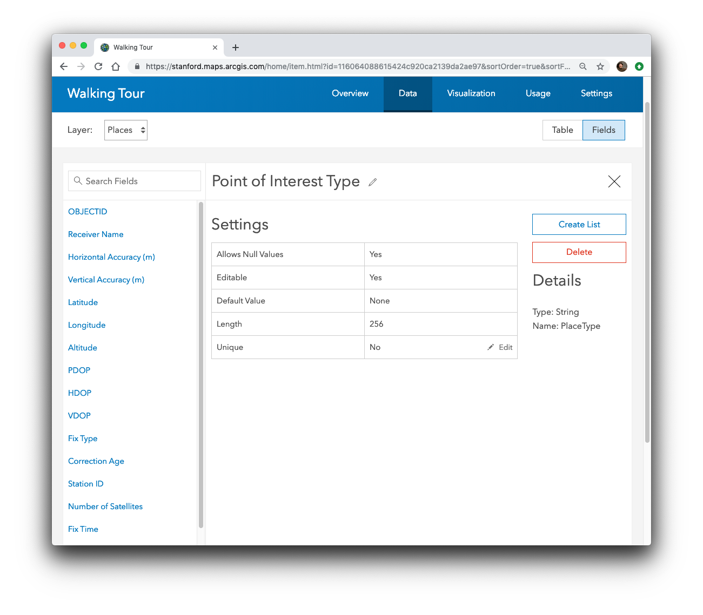  
  
10. Add entries for the following:  
 
  label|code
----:|:---
Art| 0
Architecture| 1
Gadgetry| 2
History| 3
Other| 4  

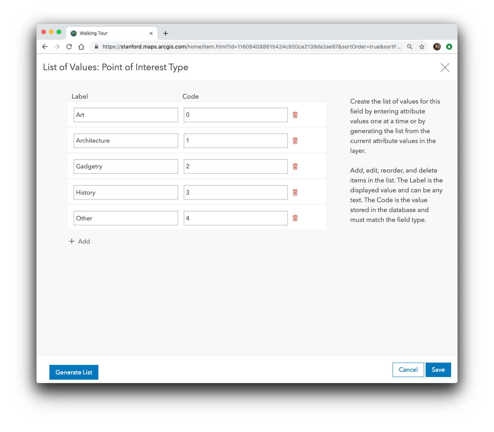  
  
11. Click **Save**.   
12. Create another field named ***Label*** that is a **String**.   
12. Create another field named ***Notes*** that is a **String**.  
 
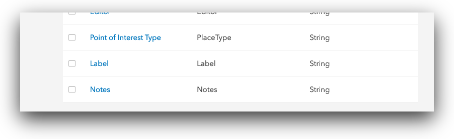   
  
  Since you want to be able to attach pictures showing the POIs in the Walking Tour, enable attachments:  
14. Go to the **Overview tab** of the item details page, scroll to the **layers list**, and click **Enable Attachments** for the Places layer.  

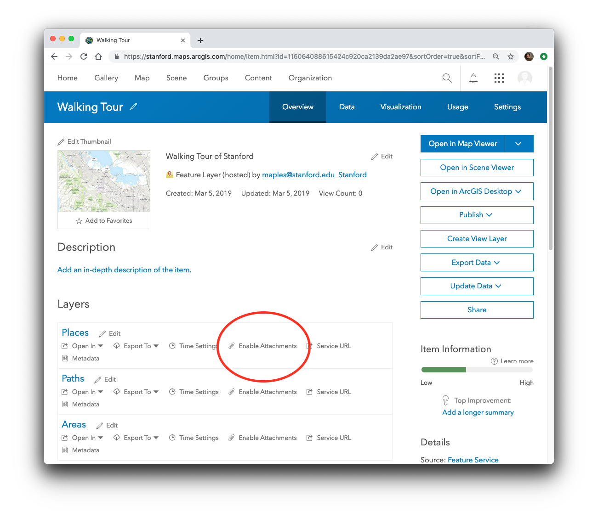   

## Part 2: Make a map  
1. Still on the **item page** of your layer, in the drop-down list for **Open in Map Viewer** pick **Add to new map** to start making your map.   

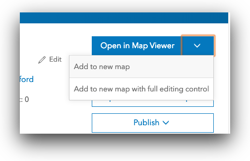  
  
  
2. **Save** your map, giving it a title "**Walking Tour [***Your initials***]**" and a **tag**.  

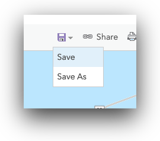  
  
3. In the **Contents pane**, hover over the layer of places, click **More Options**, choose **Rename**, and rename the layer of places to Places.  

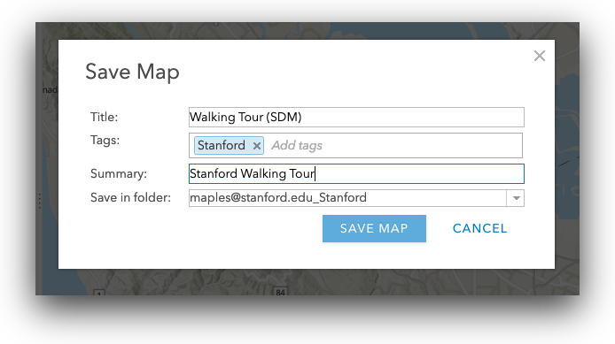  

4. Click **Change Style** for the **Places layer**, Choose to show the **POI Type** attribute.  

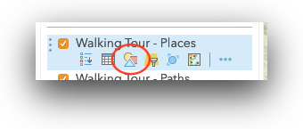  

5. Click **Options** for the **Types (Unique symbols)** drawing style.
6. Click the **symbol** next to the **Art** POI Type, click **Shape**, choose an appropriate symbol and set it to a size of **20**, then click **OK**.  

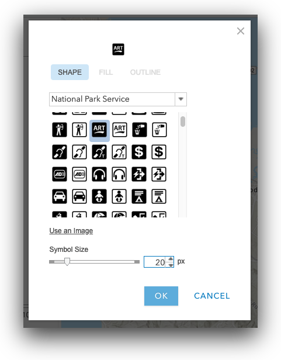  

7. Configure the symbols for the each of your other POI Types. Explore the various symbology categories available.  

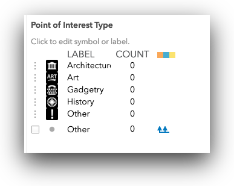  

8. Click **OK** and click **Done**.  

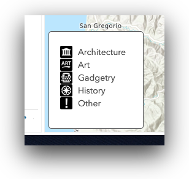  

8. Click **Edit**, click **Manage**, and click **Save Changes**.  
  
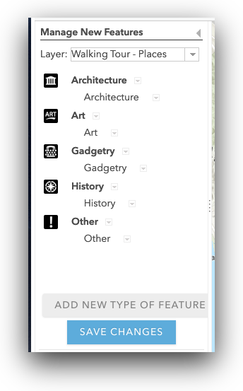  
  
*This creates feature templates that Collector will use as the POI types available in the app*.
  
9. Click on the ellipsis (...) at the end of the Places layer item and go to "Configure Pop-up"

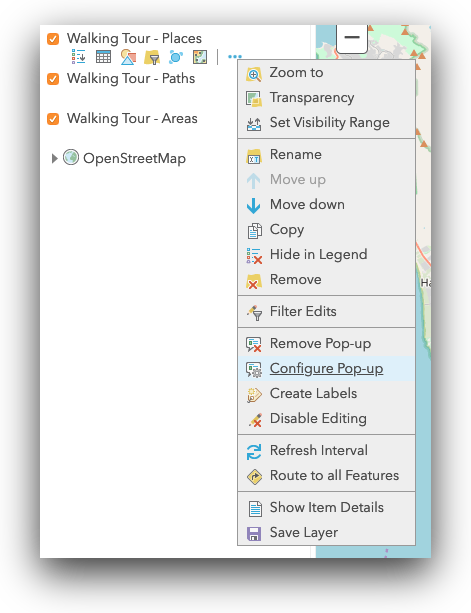

10.  Click on the "Configure Attributes" link, about half way down the "Configure Pop-up Panel."  

11. Check, then uncheck, the Disply checkbox, to turn off the display of all attributes in the Pop-up.

12. Scroll down until you see the attributes you created [{Label},{notes},{PlaceType}] and check the Edit checkboxes (which will also check the Display checkbox)

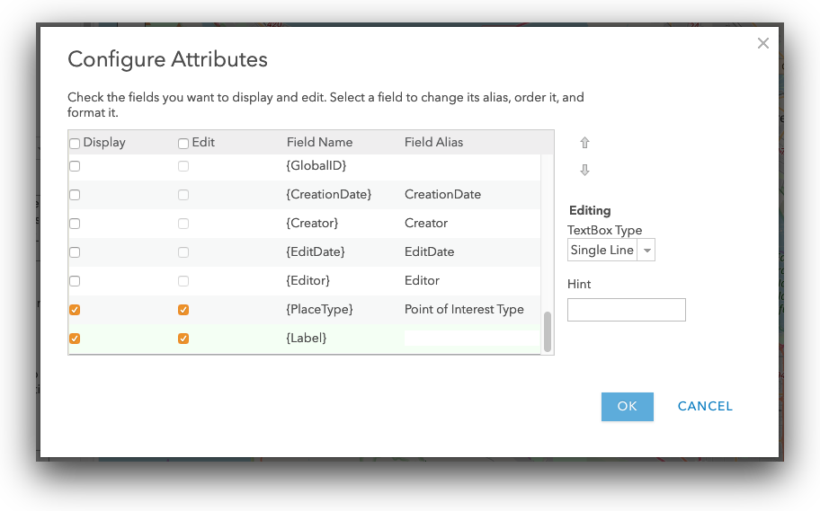  
   
13. Click OK, twice, to commit your changes and close the Configure Pop-ups panel. 

9. Change the **basemap** to **OpenStreetMap**  

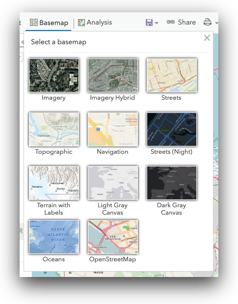  

9. Save the **map**.  

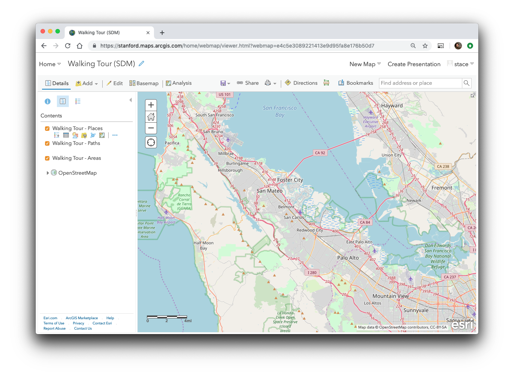  

## Part 3: Record Points of Interest with Collector  
Open Collector, using "**stanford**" as your organization, and your SUNetID and password.  
1. Choose the map you just made.  
2. To add a feature, touch the + sign and follow the prompts.

Note: Either sign in with the same account you used to make the map, or share the map with a group and sign in as a user that is a member of that group.
Walk around campus, adding public art, historically significant locations, various technology around campus, and "other" locations (picnic tables, restrooms, water fountains, etc...). 

*This tutorial was adapted from the excellent "[Make your first Collector map](https://www.esri.com/arcgis-blog/products/collector/field-mobility/make-your-first-collector-map/)" tutorial by Kylie Donia, of Esri*.
